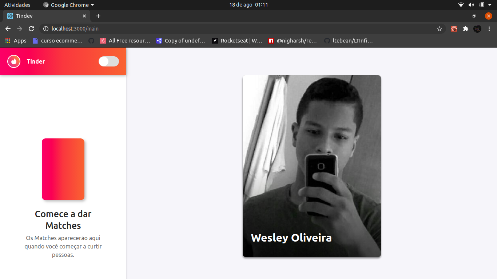

  

  

  
  
  

  

 

  App Tinder clone! Consuming the GitHub API.

  

## Tech

- Node.js
- React
- Socket.io
- PostgreSQL

### Preview

[Watch the video](https://www.youtube.com/watch?v=UM-YKRZ4dis)

## Development setup

### Back-End

- Run `yarn` in the `backend` folder;
- Run `yarn dev` to start the server

### Front-End

- Run `yarn` in the `frontend` folder;
- Run `yarn start` to up the project;

### How to contribute

- Fork this repository;
- Create a branch with your feature: `git checkout -b my-feature`;
- Commit your changes: `git commit -m 'feat: My feature'`;
- Push to your branch: `git push origin my-feature`;

After the merge of your pull request is done, you can delete your branch.
